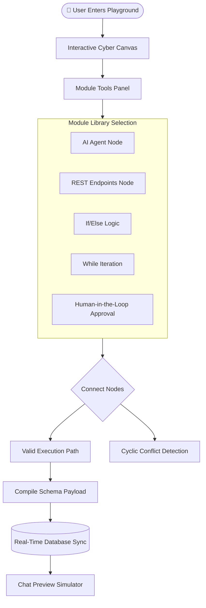

# ⚡ GetFlowDone - Premium No-Code AI Agent Builder

<p align="center">
  <b>An immersive, high-performance visual workflow canvas for building autonomous AI Agents.</b>
  <br />
  <i>Authored & Engineered by <b>Kartikeya</b></i>
</p>

<p align="center">
  <a href="https://agent-flow-dev.vercel.app/"><strong>🚀 Live Production Environment</strong></a>
</p>

---

## 🌌 About The Platform
**GetFlowDone** solves the absolute bottleneck of standard chatbots: their static, isolated nature. Powered by an immersive cybernetic interface, it empowers users to construct complex, interactive AI execution chains featuring real-time API callbacks, loop mechanics, and conditional branching via an intuitive visual drag-and-drop engine.

### ⚡ Core Capabilities
* **Dynamic REST Bridges**: Seamlessly link GET/POST external endpoints into LLM contextual pipelines.
* **Hyper-Responsive Logic Loops**: Handle multi-step operations with full `If/Else` branching and continuous `While` iterations.
* **AI Dynamic Parameter Extraction**: Contextually pull and inject parameters from user messages directly into dynamic REST variables.
* **Real-Time Canvas Sync**: Instantly save and test compiled AI runtime models against actual user endpoints.

---

## ⚙️ Workflow Engine Architecture

The Visual Playground uses an advanced graph-based model to convert canvas nodes into executable JSON automation logic. Below is the dynamic routing sequence.

### 📊 Automation Control Flow



---

## 🧠 LLM Engine & Chat Pipeline

When a user interacts with the deployed Agent console, the backend translates visual schemas into real-time actions.

```mermaid
sequenceDiagram
    autonumber
    actor User as Active User
    participant UI as Interactive Chat UI
    participant API as /api/chat Gateway
    participant LLM as Google Gemini Core
    participant Tool as /api/execute-tool
    participant Target as External Web Service

    User->>UI: Submits natural language prompt
    UI->>API: Passes query & compiled Agent schema
    API->>LLM: Evaluates context against available tools
    
    rect rgb(10, 35, 50)
        Note over LLM, Tool: Argument Extraction Phase
        LLM->>LLM: Analyzes and extracts parameter values
        LLM-->>API: Issues ToolCall dispatch payload
    end

    API->>Tool: Dispatches action (Method, Headers, Body)
    Tool->>Target: Executes HTTPS Request (REST)
    Target-->>Tool: Returns RAW Payload JSON
    Tool-->>API: Relays Payload
    
    API->>LLM: Feeds RAW payload for synthesis
    LLM-->>API: Generates natural conversational report
    API-->>UI: Delivers final visual message
    UI-->>User: Renders formatted response ⚡
```



---

## 🎨 Premium Design Matrix
GetFlowDone features an immersive **Jet Black & Cyber-Cyan** visual identity built from the ground up:
* **Animated Neon Mesh**: 60fps hardware-accelerated background wireframes layered into the DOM root.
* **Split-Jack Connections**: Connectors automatically adopt green glow states for `TRUE` paths and rose red for `FALSE` paths.
* **Glassmorphic Config Panels**: High-contrast settings modules with dynamic form inputs optimized for flawless dark-mode visibility.

---

## 🛠️ Enterprise Tech Stack

| Layer | Technology | Description |
| :--- | :--- | :--- |
| **Frontend Framework** | **Next.js 16** | Advanced React rendering with App Router & Turbopack optimization. |
| **Visual Graph System** | **React Flow** | Highly customized vector canvas with custom dynamic glow nodes. |
| **Core AI Engine** | **Google Gemini 2.0 Flash** | Ultra-fast contextual processing & conversational response synthesis. |
| **State & Database** | **Convex DB** | Real-time WebSocket persistence layer for zero-latency autosaving. |
| **Identity & Security** | **Clerk Auth & Arcjet** | Premium secure JWT authentication paired with active rate-limiting. |
| **Design System** | **Tailwind CSS v4** | Custom OKLCH neon-palette mappings with smooth micro-transitions. |

---

## ⚡ Platform Verification & Quality Check

The system is compiled and verified via rigorous production environment dry-runs:
```bash
▲ Next.js 16.1.1 (Turbopack)
  Creating an optimized production build ...
✓ Compiled successfully in 4.7s
✓ Generating static pages (11/11)
Exit code: 0 (System Stable / Staging Ready)
```

---

## ✨ Developed By

This platform was architected and customized for maximum visual elegance and technical performance by:
* **Primary Developer**: [Kartikeya](https://github.com/KartikeyaM2007)

---
